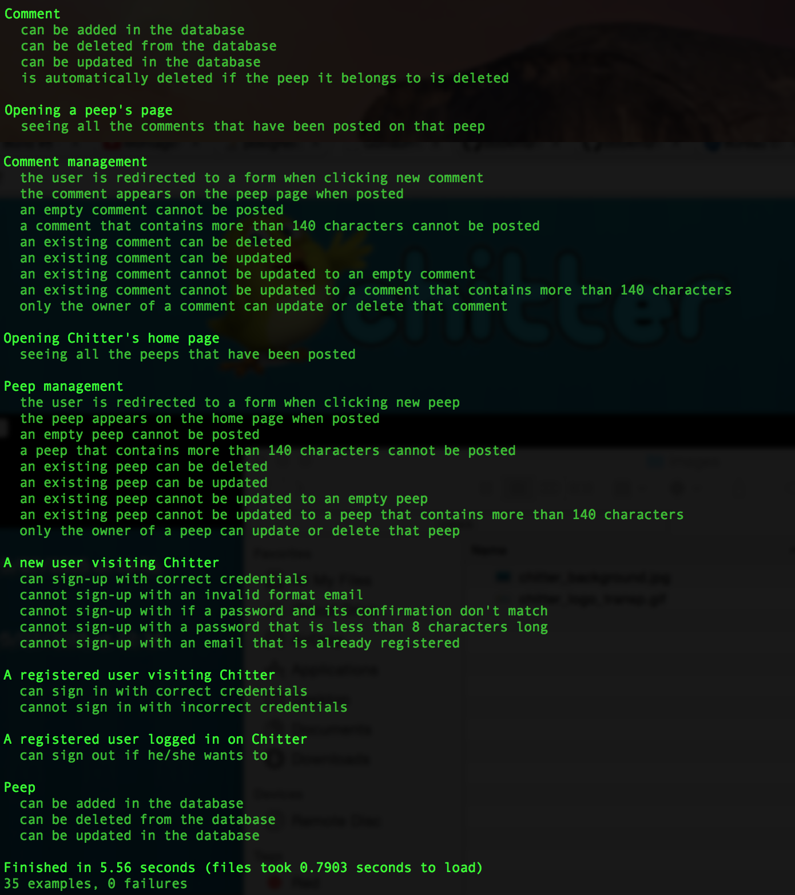

:baby_chick: Chitter Challenge :baby_chick:
=================
This is the week 4 challenges at Makers Academy; to create Chitter; a Twitter-like application. Users can signup, login, recover their passwords and post to a public board.


Notes on functionality requested from the challenge:
------

* Users sign up to chitter with their email, password, name and a user name. The username and email are unique.
* Peeps (posts to chitter) have the name of the maker and their user handle.
* A user doesn't have to be logged in to see the peeps but he/she has to be, to post, update and delete his/her peeps.

Bonus from the challenge, which I both did:
-----

* Users can post comments to peeps. A user can only post, update and delete his/her comments if he/she is logged in.
* Work on the css to make it look good.


Heroku
----
[Link coming soon]()

Objectives of exercise
----
To learn about SQL databases and users administrations (sign up, in and out), as well as frontend design with HTML and CSS technologies.

Technologies used
----
- Ruby
- Postgresql and Datamapper
- Rspec and Capybara
- Sinatra
- Bcrypt, rack-flash
- HTML5 and erb files
- CSS3
- Git
- Heroku

How to run it
----
```
git clone git@github.com:GBouffard/chitter-challenge.git
cd chitter-challenge
bundle
psql
CREATE DATABASE chitter_development;
CREATE DATABASE chitter_test;
rackup
```
You can now open localhost:9292 in your browser, sign up, in and out and post peeps and comments.

How to run tests
----
```
cd chitter-challenge
rake
```

and this is what you should see


